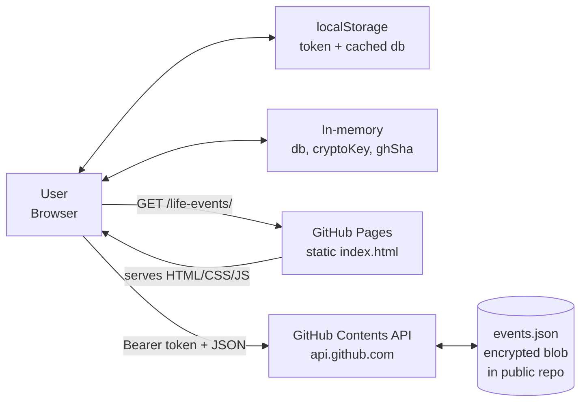
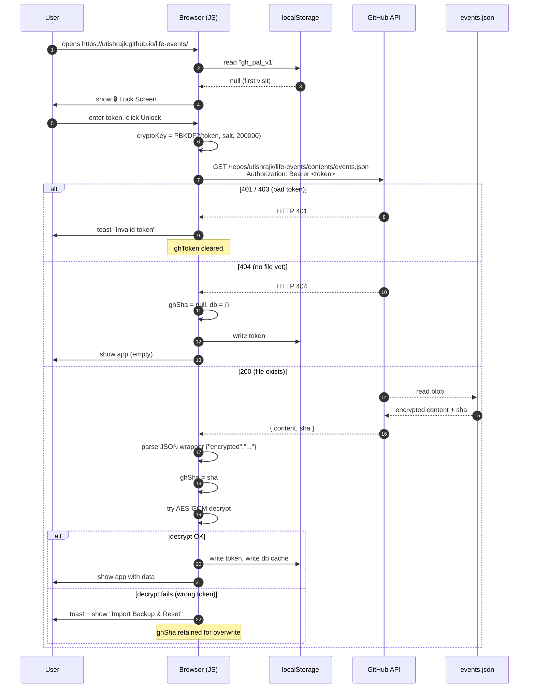
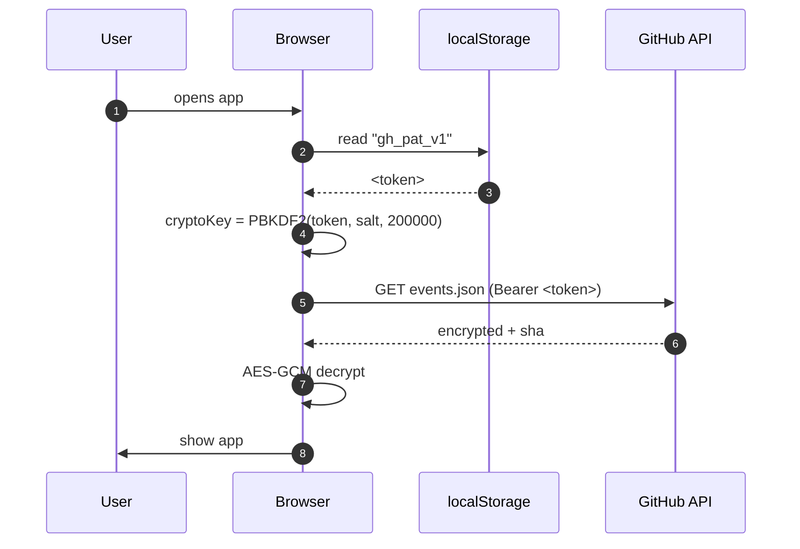
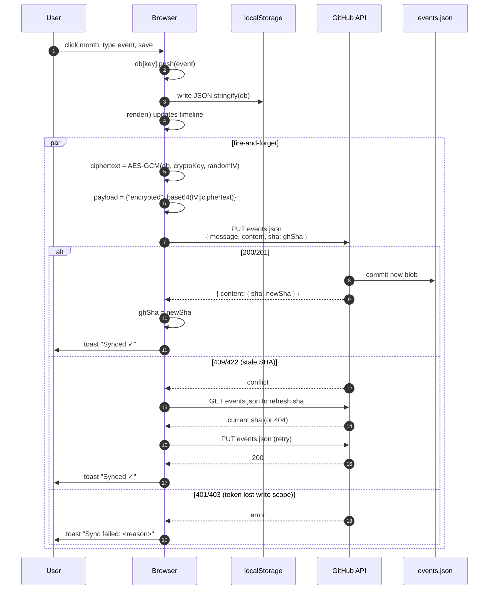
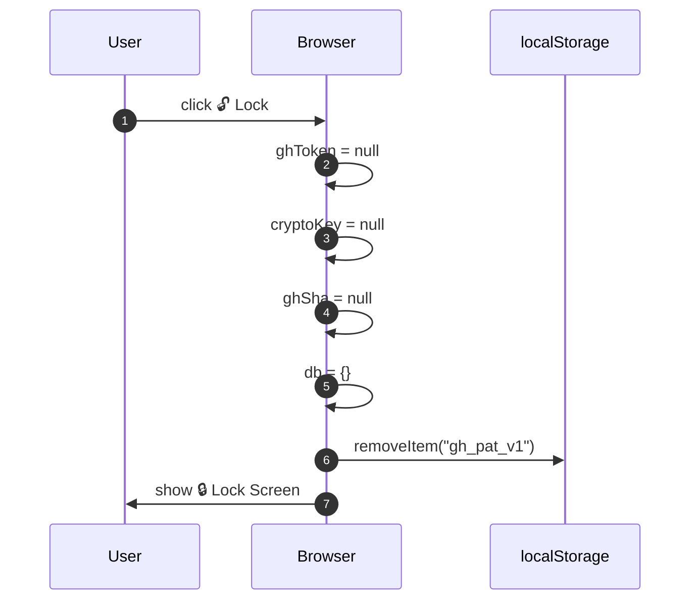
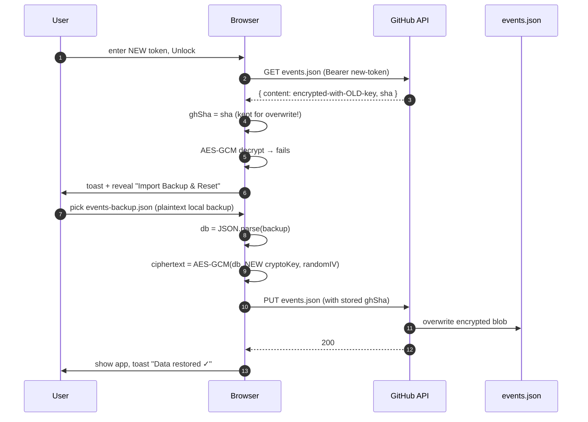

# Life Journey — Security & Data Flow

A single-page app served from GitHub Pages with end-to-end encrypted persistence in a public GitHub repo. The browser is the only place where data is ever in plaintext.

---

## 1. Components



**Trust boundaries:**
- **In the browser** (trusted): plaintext events, derived AES key, the token itself.
- **On disk in localStorage** (trusted, machine-local): the GitHub token and a cached plaintext copy of the db.
- **In transit & on GitHub** (untrusted): everything is encrypted ciphertext.

---

## 2. Cryptographic primitives

| Primitive | Algorithm | Parameters |
|---|---|---|
| Key derivation | **PBKDF2** | salt = `"life-journey-v1-salt"`, iterations = **200,000**, hash = SHA-256 |
| Symmetric cipher | **AES-256-GCM** | key length 256, random 96-bit IV per encryption |
| Auth tag | Built into GCM (128-bit) — wrong key → decryption throws |

The GitHub Personal Access Token (PAT) **is** the passphrase. The token serves two independent purposes:

1. **GitHub API authentication** (`Authorization: Bearer <token>`)
2. **Encryption key material** (PBKDF2 → AES key, derived only in the browser, never sent anywhere)

This means if GitHub itself is fully compromised, the attacker still cannot read your events without your token. And if your token leaks, the attacker can read **everything** — both worlds collapse together.

---

## 3. Wire format of `events.json`

```json
{ "encrypted": "<base64( IV[12 bytes] || AES-GCM ciphertext )>" }
```

The IV is prepended to the ciphertext. A fresh random IV is generated on every save, so re-saving the same data produces completely different ciphertext.

---

## 4. Unlock flow (first visit on a browser)



### What this protects

- **No data exposure on first request**: even a curl of the repo's `events.json` returns ciphertext only.
- **Token validity is checked against GitHub before being stored** — invalid tokens never persist.
- **Wrong-token-but-valid-API-credentials** is handled gracefully (the Reset flow, §8).

---

## 5. Auto-unlock (returning visit, same browser)



The token persists in `localStorage` indefinitely until you click 🔓 **Lock** or your browser clears site data. There is no session timeout.

---

## 6. Write flow (adding / editing / deleting an event)



### Key properties

- **Local-first**: `localStorage` is written *before* the network call. Even if GitHub is down, your edit is not lost — next successful save will catch up.
- **Optimistic concurrency**: the `sha` field prevents overwriting a concurrent change. On conflict we re-fetch and retry once.
- **Fresh IV per write**: two identical event-lists produce two completely different ciphertexts. No deterministic patterns leak.
- **Token used only on the GitHub API**: never logged, never sent to any third party.

---

## 7. Lock / Logout flow



After lock:
- The token is purged from both memory and `localStorage`.
- The derived AES key (which existed only in memory as a non-extractable `CryptoKey`) becomes unreachable and is garbage-collected.
- The plaintext db cached in `localStorage` (under key `lifeJourney_v1`) is also implicitly stale; nothing can read it back without the token + key.
- **The repo's `events.json` is untouched** — it remains encrypted on GitHub.

> Note: closing the browser tab without clicking Lock does **not** clear the token. Anyone with access to that browser profile can reopen and auto-unlock.

---

## 8. Recovery flow (token rotated — wrong-passphrase case)

If your token was regenerated or revoked, the old encrypted `events.json` cannot be decrypted with the new token. The app detects this and offers a recovery path:



The key insight: **the GitHub API request succeeded** (the new token is valid), only the *decryption* failed. So we already have a valid `sha` to overwrite the file with.

---

## 9. Token verification — at every step

| Where | How |
|---|---|
| Lock screen Unlock | A GET request to the repo's `events.json`. 401/403 means rejected by GitHub; 200/404 means the token is real. |
| Auto-unlock on page load | Same GET, but the catch handler resets and shows the lock screen instead of toasting. |
| Every save | The PUT request implicitly re-verifies. A revoked token surfaces as `Sync failed: Bad credentials`. |

The app never *trusts* a token because it has the right shape — it always proves it against GitHub before storing it.

---

## 10. What an attacker can / cannot do

| Scenario | Outcome |
|---|---|
| Clones the public repo | Sees `events.json` ciphertext only. AES-256-GCM with 200k-round PBKDF2 → brute force infeasible. |
| MITM on the wire | TLS to api.github.com + ciphertext payload. Two layers, both strong. |
| Reads GitHub Pages HTML/JS | Sees only the app code; no secrets are embedded. |
| Steals your laptop / browser profile | Gets the token from `localStorage` → full access. **Lock when stepping away on shared machines.** |
| GitHub itself is compromised | Reads ciphertext only; cannot decrypt without your token. |
| Old token leaked but rotated | Old `events.json` ciphertexts encrypted under the old token remain decryptable by anyone holding it. **Re-encrypting under a new token does not retroactively protect old commits.** Treat history-purge as the remedy. |
| Browser console open at the wrong moment | Token and `cryptoKey` are in memory and inspectable via DevTools. There is no defence against an attacker with JS execution in your tab. |

---

## 11. What lives where — at-a-glance

| Item | Browser memory | localStorage | GitHub repo | Notes |
|---|:---:|:---:|:---:|---|
| GitHub token | ✓ | ✓ | ✗ | Cleared on Lock |
| Derived AES key | ✓ | ✗ | ✗ | Non-extractable `CryptoKey` |
| db (plaintext) | ✓ | ✓ (cached) | ✗ | Cache is unreadable without the token to derive the key — actually wait, no, the cache **is** plaintext JSON. See §12. |
| events.json (ciphertext) | ✗ | ✗ | ✓ | The only persistent storage |
| Random IV | ✓ (per save) | ✗ | ✓ (embedded in ciphertext) | Fresh per write |

---

## 12. Honest caveats

1. **`localStorage` cache of plaintext db.** The app caches the plaintext db in `localStorage` for fast loads. Anyone with read access to your browser profile (malware, another OS user) can read both the token and the cached events. Clearing site data removes both, but Lock alone only removes the token — the plaintext cache (key `lifeJourney_v1`) lingers until overwritten. *(Possible hardening: encrypt the localStorage cache too, or skip caching entirely.)*

2. **Token = encryption key.** If you rotate your GitHub token, you can no longer decrypt past `events.json` blobs encrypted under the previous token. Always keep an exported backup before rotating. The Recovery flow (§8) handles this only if you have a backup file.

3. **History remembers.** Every save creates a new commit. The old ciphertext blobs remain in git history forever (unless you rewrite history and contact GitHub support to purge cached objects). This is fine while the encryption holds — but if your token ever leaks, **every historical ciphertext blob becomes decryptable**, not just the current one.

4. **GitHub Pages is public.** The HTML is public, which is what enables the app to be loaded from anywhere. There is no per-user code or server.

5. **No multi-device conflict resolution beyond optimistic-locking by SHA.** If you save simultaneously on two browsers, the second save retries once on conflict; in pathological races the later write wins. There is no merge.
